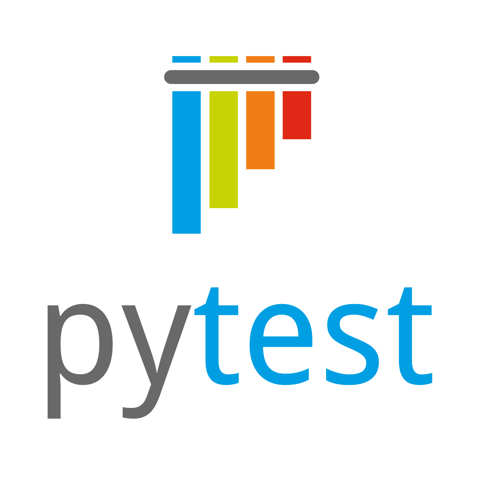
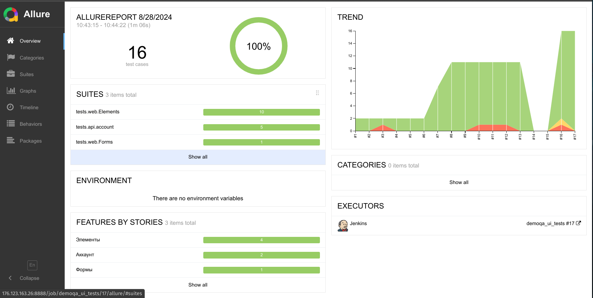
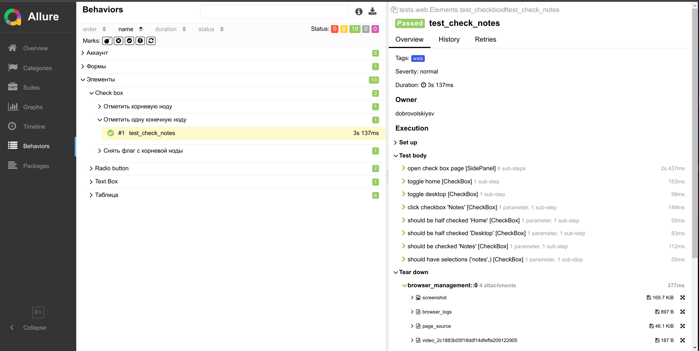

<h1 align="center">Проект UI и API тестов <a href="demoqa.com">demoqa.com</a></h1>
<h4 align="center"><a href="demoqa.com">  </a>
</h4>

<h3 align="center">Python | Pytest | Selene | Requests | Jenkins | Selenoid | Allure | Telegram</h3>
<h3 align="center">

</h3>

---

> <a target="_blank" href="http://176.123.163.26:8888/job/demoqa_ui_tests/">Ссылка на проект в мой Jenkins: доступны
> прогоны и allure отчёты</a>

### Реализованы тесты:

#### UI

##### Elements

- [X] [Text Box] Простая регистрация
- [X] [Check Box] Выбор корневой ноды
- [X] [Check Box] Выбор конечной ноды
- [X] [Check Box] Выбор снятие флага с корневой ноды
- [X] [Radio Button] Выбор
- [X] [Radio Button] Переключение выбора
- [X] [Web Tables] Добавление записи
- [X] [Web Tables] Редактирование записи
- [X] [Web Tables] Поиск записи
- [X] [Web Tables] Удаление записи

##### Forms

- [X] Полная регистрация

#### API

- [X] Успешная авторизация
- [X] Авторизация с неверным паролем
- [X] Авторизация с неверным логином
- [X] Авторизация с пустым логином
- [X] Авторизация с пустым паролем
- [X] Авторизация с пустым телом запроса
- [X] Успешная генерация токена
- [X] Проваленная генерация токена

## Запуск тестов

> Для тестов API требуется <a href="https://demoqa.com/register">регистрация</a> в Book Store Application и заполнение
> login\password в .env

### Локально

1. Клонировать репозиторий

```bash
git clone https://github.com/vinterbris/demoqa-project.git
```

2. В терминале в директории проекта создать и активировать виртуальное окружение

```bash
python -m venv .venv 
source .venv/bin/activate
```

3. Установить зависимости

```
pip install -r requirements.txt
```

5. Запустить командой

```bash
pytest
```

#### Получение отчета allure

```bash
allure serve
```

### Локально через удалённый Selenoid

Создаём в корневой директории файл .env и вносим в него логин и пароль для магазина.

```bash
cp .env.example .env
```

В .env включаем selenoid, указываем доступную на нём версию браузера и его url

```
SELENOID=True
BROWSER_VERSION=127.0
SELENOID_URL=http://localhost:4444
```

## Пример отчёта



Автогенерация названий шагов в allure из названий функций



## Оповещения в мессенджер

> _Настроена отправка оповещений в телеграм канал. Возможна настройка для Email,Slack, Discord, Skype, Mattermost,
Rocket.Chat_


## Пример запуска тестов

https://github.com/user-attachments/assets/d40a9480-4900-438c-a629-ce089f96a800

https://github.com/user-attachments/assets/01dbf222-e13e-49aa-be03-df138a8f8eea

