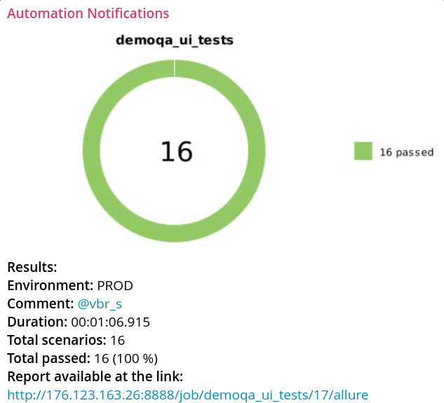

<h1 align="center">Проект UI и API тестов <a href="demoqa.com">demoqa.com</a></h1>
<h1 align="center"><a href="respublica.ru">  </a>
</h1>


<h3 align="center">Python | Pytest | Selene | Requests | Jenkins | Selenoid | Allure | Telegram</h3>
<h3 align="center">
      &nbsp;&nbsp;&nbsp;&nbsp;
      &nbsp;&nbsp;&nbsp;&nbsp;
      &nbsp;&nbsp;&nbsp;&nbsp;&nbsp;
      &nbsp;&nbsp;&nbsp;&nbsp;
     &nbsp;&nbsp;&nbsp;&nbsp;
    &nbsp;&nbsp;&nbsp;&nbsp;&nbsp;
      &nbsp;&nbsp;&nbsp;&nbsp;

</h3>

---
> <a target="_blank" href="http://176.123.163.26:8888/job/demoqa_ui_tests/">Ссылка на проект в мой Jenkins: доступны прогоны и allure отчёты</a>

### Реализованы тесты:
#### UI
##### Elements
- [x] [Text Box] Простая регистрация 
- [x] [Check Box] Выбор корневой ноды
- [x] [Check Box] Выбор конечной ноды
- [x] [Check Box] Выбор снятие флага с корневой ноды
- [x] [Radio Button] Выбор 
- [x] [Radio Button] Переключение выбора
- [x] [Web Tables] Добавление записи
- [x] [Web Tables] Редактирование записи
- [x] [Web Tables] Поиск записи
- [x] [Web Tables] Удаление записи
##### Forms
- [x] Полная регистрация 

#### API
- [x] Успешная авторизация
- [x] Проваленная авторизация
- [x] Авторизация без данных входа
- [x] Авторизация без данных входа
- [x] Успешная генерация токена
- [x] Проваленная генерация токена


## Запуск тестов

> Для тестов API требуется <a href="https://demoqa.com/register">регистрация</a> в Book Store Application и заполнение login\password в .env 

### Локально

1. Клонировать репозиторий 
```bash
git clone https://github.com/vinterbris/demoqa-project.git
```
2. В терминале в директории проекта создать и активировать виртуальное окружение
```bash
python -m venv .venv 
source .venv/bin/activate 
```
3. Установить зависимости
```
pip install -r requirements.txt 
```

5. Запустить командой
```bash
pytest
```

#### Получение отчета allure
```bash
allure serve
```

### Локально через удалённый Selenoid
Создаём в корневой директории файл .env и вносим в него логин и пароль для магазина. 

```bash
cp .env.example .env
```

В .env включаем selenoid, указываем доступную на нём версию браузера и его url

```
SELENOID=True
BROWSER_VERSION=127.0
SELENOID_URL=http://localhost:4444
```

## Оповещения в мессенджер

> _Настроена отправка оповещений в телеграм канал. Возможна настройка для Email,Slack, Discord, Skype, Mattermost, Rocket.Chat_



## Пример запуска тестов

https://github.com/user-attachments/assets/d40a9480-4900-438c-a629-ce089f96a800

https://github.com/user-attachments/assets/01dbf222-e13e-49aa-be03-df138a8f8eea
